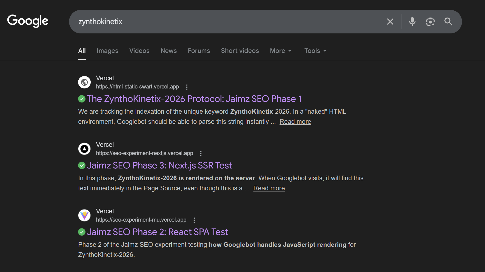

# SEO Experiment (HTML vs React vs Next.js)

This project is a controlled experiment to understand how Google indexes and ranks websites built with different rendering strategies.

I am testing:

* **Static HTML:** The baseline (Phase 1).
* **React SPA:** Client-Side Rendering / CSR (Phase 2).
* **Next.js:** Server-Side Rendering / SSR (Phase 3).

All versions:
- Deployed on Vercel

Primary success metric:
If it appears in Google, it is indexed. I created a nonsensical keyword "ZynthoKinetix-2026" to ensure no other search results would interfere with the experiment.

---

## Comparison Matrix

| Metric | Phase 1 (Static HTML) | Phase 2 (React SPA) | Phase 3 (Next.js SSR) |
| --- | --- | --- | --- |
| **Status** | Complete | Complete | Complete |
| **Deploy Date** | Feb 6, 2026 | Feb 9, 2026 | Feb 9, 2026 |
| **Index Date (site:)** | Feb 7, 2026 | Feb 9, 2026 | Feb 10, 2026 |
| **View Source Visible?** |  Yes |  No | Yes |
| **Keyword Search** |  Success |  Success |  *Success |

---

## Phase 1 Results (Static HTML)

* **URL:** [https://html-static-swart.vercel.app/](https://html-static-swart.vercel.app/)
* **Keyword:** ZynthoKinetix-2026
* **Result:** Successfully indexed within 24 hours. The keyword was found in the raw HTML, leading to immediate indexing. Lighthouse Score: 100/100.

---

## Phase 2 Results (React SPA)

* **URL:** [https://seo-experiment-mu.vercel.app/](https://seo-experiment-mu.vercel.app/)
* **Strategy:** Client-Side Rendering (CSR).
* **Keyword:** ZynthoKinetix-2026
* **Observation:** "View Source" showed only an empty `

`.
* **Result:** Successfully Idexed (kinda). Google’s Web Render Service successfully executed the JavaScript bundle, identified the keyword, and indexed the page with the correct snippet.
* **Takeaway:** Google is capable of rendering JS, but there is a "Rendering Queue" delay compared to static HTML that is resposible for rendering sites that require JS

---

## Phase 3 Results (Next.js SSR)

* **URL:** [https://seo-experiment-nextjs.vercel.app/](https://seo-experiment-nextjs.vercel.app/)
* **Strategy:** Server-Side Rendering (SSR).
* **Keyword:** ZynthoKinetix-2026
* **Observation:** Unlike React, the keyword was immediately visible in the **Page Source**, confirming the server pre-rendered the content.
* **Hydration:** Confirmed the "Zombie State" where the page is visible before the JS "wakes up" the interactive elements.
* **Result:** Successfully Indexed quickly and reliably.
* **Final Verdict:** SSR combines the SEO reliability of Phase 1 with the modern interactivity of Phase 2. It is the "Gold Standard" as it populates meta-tags and content for bots without requiring them to perform extra rendering work.

---

### Final Conclusion

This experiment confirms that while Google can index all three, the method matters:

* **Static HTML:** Fastest indexing but a little limited when it comes to interactivity.
* **React (CSR):** Interactive, but risky for SEO. It forces Google to use a "Second Wave" of rendering to find content missing from the Page Source, which can cause indexing delays.
* **Next.js (SSR):** The professional winner. It delivers the SEO-readiness of Static HTML with the power of React.

**The Verdict:** **Next.js** is superior for production because it guarantees your content is indexed in the "First Wave" and ensures perfect **social media previews** (WhatsApp/Twitter) that CSR simply can't provide.

---

### Visual Proof

